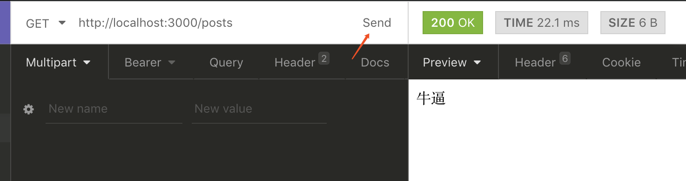

# Nest.js学习

> web开发

## 环境准备

## 控制器 

1. 查看帮助

   终端中输入`nest --help`

2. 创建控制器

```bash
nest generate controller 控制器名
或者
nest g co 控制器名
创建一个叫做posts的控制器
nest g co posts
```

3. 进入项目找到被创建出来的控制器文件`src/posts/posts.controller.ts`
   1. 使用装饰器修饰内容
   2. 使用装饰器修饰方法
   3. 使用返回不同类型的值
      1. 字符串
      2. 数组或对象

```typescript
import { Controller, Get } from '@nestjs/common';

// 装饰器 posts作为请求的前缀
@Controller('posts')
export class PostsController {
    // 装饰器
    @Get()
    // 被装饰的方法
    index(){
        // 请求的返回值 字符串支持
        // return '牛逼'
        // 返回对象或者数组会被自动转化为JSON
        return {
            name:'jack',
            age:18,
            friend:[
                {
                    name:'rose',
                    skill:'不怕冷'
                }
            ]
        }
    }
}

```

4. 使用`insomnia`测试



